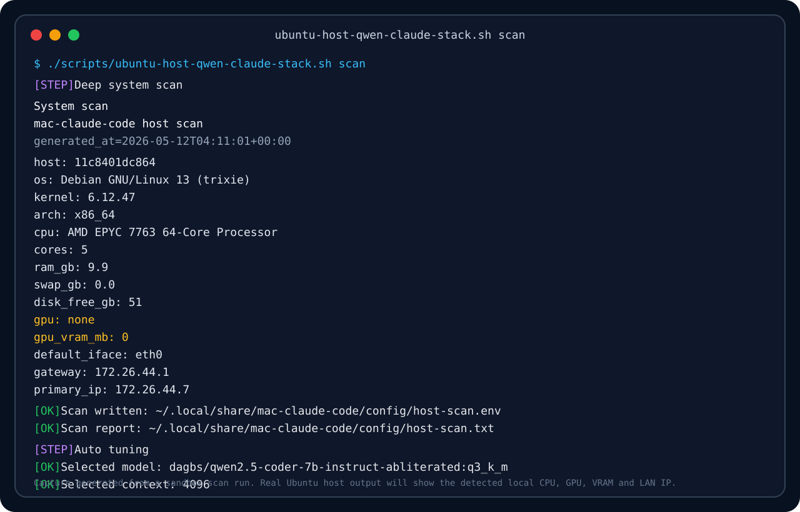
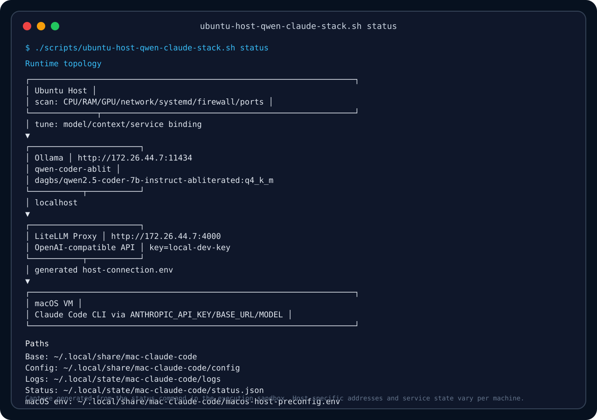
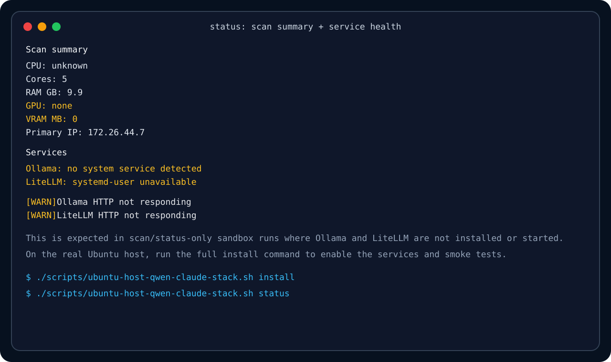

# mac-claude-code

```text
┏━━━━━━━━━━━━━━━━━━━━━━━━━━━━━━━━━━━━━━━━━━━━━━━━━━━━━━━━━━━━━━━━━━━━━━━━━━━━━━━━━━━━━━┓
┃                                                                                      ┃
┃  ███╗   ███╗ █████╗  ██████╗      ██████╗██╗      █████╗ ██╗   ██╗██████╗ ███████╗  ┃
┃  ████╗ ████║██╔══██╗██╔════╝     ██╔════╝██║     ██╔══██╗██║   ██║██╔══██╗██╔════╝  ┃
┃  ██╔████╔██║███████║██║          ██║     ██║     ███████║██║   ██║██║  ██║█████╗    ┃
┃  ██║╚██╔╝██║██╔══██║██║          ██║     ██╔══██╗██╔══██║██║   ██║██║  ██║██╔══╝    ┃
┃  ██║ ╚═╝ ██║██║  ██║╚██████╗     ╚██████╗███████║██║  ██║╚██████╔╝██████╔╝███████╗  ┃
┃  ╚═╝     ╚═╝╚═╝  ╚═╝ ╚═════╝      ╚═════╝╚══════╝╚═╝  ╚═╝ ╚═════╝ ╚═════╝ ╚══════╝  ┃
┃                                                                                      ┃
┃       LOCAL CLAUDE CODE STACK FOR A macOS VM                                         ┃
┃       Ubuntu Host · Ollama · LiteLLM · Qwen Coder Abliterated                        ┃
┃                                                                                      ┃
┗━━━━━━━━━━━━━━━━━━━━━━━━━━━━━━━━━━━━━━━━━━━━━━━━━━━━━━━━━━━━━━━━━━━━━━━━━━━━━━━━━━━━━━┛

        .-''''''''''''''''''''''''''''''''''''''''''''''''''''''''''''''''''-.
       /  WALL #11434 + #4000                                                 \
      /  "THE CLOUD WAS JUST SOMEONE ELSE'S COMPUTER WITH BETTER MARKETING"    \
     /__________________________________________________________________________\
     |                                                                          |
     |       ┌─────────────────────┐                                            |
     |       │      macOS VM        │                                            |
     |       │ VS Code / Claude     │                                            |
     |       │ claude-local .env    │                                            |
     |       └──────────┬──────────┘                                            |
     |                  │                                                       |
     |                  │  ANTHROPIC_BASE_URL                                   |
     |                  │  ANTHROPIC_API_KEY                                    |
     |                  │  ANTHROPIC_MODEL                                      |
     |                  ▼                                                       |
     |       ┌─────────────────────┐        ┌─────────────────────┐             |
     |       │   LiteLLM Proxy      │◄───────│ host-connection.env │             |
     |       │   :4000              │        │ macOS preconfig     │             |
     |       │   OpenAI-ish API     │        └─────────────────────┘             |
     |       └──────────┬──────────┘                                            |
     |                  │                                                       |
     |                  ▼                                                       |
     |       ┌─────────────────────┐                                            |
     |       │      Ollama          │        NO API RENT.                        |
     |       │      :11434          │        NO CLOUD PRIEST.                    |
     |       │  qwen-coder-ablit    │        NO TOKEN TAX.                       |
     |       └──────────┬──────────┘                                            |
     |                  │                                                       |
     |                  ▼                                                       |
     |       ┌─────────────────────┐                                            |
     |       │   NVIDIA / CUDA      │                                            |
     |       │   local inference    │                                            |
     |       │   host-side muscle   │                                            |
     |       └─────────────────────┘                                            |
     |                                                                          |
     |             ____                                                         |
     |        _.-'`    `'-._             ┌───────────────┐                      |
     |      .'   .--.       '.           │ SYSTEM SCAN   │                      |
     |     /    /    \        \          │ CPU / RAM     │                      |
     |    ;    |  ()  |        ;         │ GPU / VRAM    │                      |
     |    |     \    /         |         │ CUDA / LAN IP │                      |
     |    ;      '--'      _   ;         │ UFW / PORTS   │                      |
     |     \             (o)  /          └───────┬───────┘                      |
     |      '.              .'                   │                              |
     |        '-._      _.-'                     ▼                              |
     |            `''''`                  ┌───────────────┐                      |
     |                                    │ AUTO TUNER    │                      |
     |        [ CCTV watching             │ q5 ≥ 11 GB    │                      |
     |          a local model             │ q4 ≥  7 GB    │                      |
     |          become self-employed ]    │ iq ≥  5 GB    │                      |
     |                                    │ q3 fallback   │                      |
     |                                    └───────────────┘                      |
     |                                                                          |
     |   (\_/)                                                                  |
     |   ( •_•)    rat@wall:~$ curl localhost:4000/v1/models                    |
     |  / > spray                                                               |
     |                                                                          |
     |   ──────────────────────────────────────────────────────────────────     |
     |   STENCIL NOTES                                                          |
     |   • macOS stays light                                                    |
     |   • Ubuntu does the heavy lifting                                         |
     |   • LiteLLM speaks the dialect                                           |
     |   • Ollama hides the engine                                              |
     |   • Qwen writes the code                                                 |
     |   • CUDA burns the incense                                               |
     |   ──────────────────────────────────────────────────────────────────     |
     |                                                                          |
     '--------------------------------------------------------------------------'
```

Local Claude Code stack for a macOS VM backed by an Ubuntu host running Ollama, Qwen2.5 Coder abliterated, and a LiteLLM proxy.

The design is deliberately split:

```text
macOS VM
  VS Code + Claude Code CLI
        ↓ ANTHROPIC_* env from generated preconfig
Ubuntu host
  system scan + GPU detection + auto tuning
        ↓
  LiteLLM proxy
        ↓
  Ollama
        ↓
  dagbs/qwen2.5-coder-7b-instruct-abliterated:q4_k_m
```

The macOS VM remains the development workstation. The Ubuntu host does the model work, where NVIDIA/CUDA acceleration is available.

## Hardened scripts

The active Ubuntu host entrypoint now routes through v3. The v3 wrapper preserves the full v2.1 implementation and applies the final model detection and status JSON fixes before execution.

```text
scripts/ubuntu-host-qwen-claude-stack.sh        → scripts/ubuntu-host-qwen-claude-stack-v3.sh
scripts/ubuntu-host-qwen-claude-stack-v2.sh     → scripts/ubuntu-host-qwen-claude-stack-v3.sh
scripts/ubuntu-host-qwen-claude-stack-v3.sh     → patches/runs scripts/ubuntu-host-qwen-claude-stack-v2.1.sh
scripts/macos-vm-claude-client.sh               → scripts/macos-vm-claude-client-v2.2.sh
scripts/macos-vm-claude-client-v2.2.sh           → patches/runs scripts/macos-vm-claude-client-v2.sh
```

Use the compatibility entrypoint for normal host installs:

```bash
# Ubuntu host
chmod +x scripts/ubuntu-host-qwen-claude-stack.sh
./scripts/ubuntu-host-qwen-claude-stack.sh install
```

Or call the active wrapper directly:

```bash
chmod +x scripts/ubuntu-host-qwen-claude-stack-v3.sh
./scripts/ubuntu-host-qwen-claude-stack-v3.sh install
```

For the macOS VM:

```bash
chmod +x scripts/macos-vm-claude-client.sh
HOST_CONFIG_PATH=./macos-host-preconfig.env ./scripts/macos-vm-claude-client.sh install
```

The hardened scripts add process tracking, PID-file cleanup, exponential network backoff, stronger `.env` generation, timeout-protected systemd checks, safer uninstall behavior, offline testing support, improved shell profile handling, and the stencil-wall terminal banners.

### Final hardening fixes

The latest patch set includes:

- macOS `doctor` no longer double-runs the live health probe.
- macOS status JSON escapes backslashes and double quotes before writing JSON.
- macOS optional Ollama launcher uses `ollama run "$MODEL_ALIAS"` instead of the invalid `ollama launch` flow.
- Ubuntu model detection handles Ollama `name:tag` output by stripping tags before comparing model aliases.
- Ubuntu status JSON escapes string fields before writing `status.json`.
- README and script banners now use the richer stencil-wall terminal art.

## Terminal captures

These captures show the actual script flow from a sandboxed scan/status run. They preview the terminal UX before you run the installer on the real Ubuntu host.

The sandbox does not expose your RTX 2070, local LAN, or systemd services, so the values shown here are illustrative. On your real Ubuntu host, the scan should show your i7-11700, RTX 2070, CUDA/NVIDIA driver, 32 GB RAM, and your LAN IP.

### Deep system scan



### Runtime topology and generated paths



### Service health before full install



## What this repository contains

```text
.
├── .env.example
├── .github/workflows/shellcheck.yml
├── .gitignore
├── README.md
├── docs
│   └── images
│       ├── terminal-scan-capture.svg
│       ├── terminal-service-health.svg
│       └── terminal-status-topology.svg
└── scripts
    ├── macos-vm-claude-client.sh
    ├── macos-vm-claude-client-v2.sh
    ├── macos-vm-claude-client-v2.2.sh
    ├── ubuntu-host-qwen-claude-stack.sh
    ├── ubuntu-host-qwen-claude-stack-v2.sh
    ├── ubuntu-host-qwen-claude-stack-v2.1.sh
    ├── ubuntu-host-qwen-claude-stack-v2.2.sh
    └── ubuntu-host-qwen-claude-stack-v3.sh
```

## Default model and auto-tuning

Default model:

```text
dagbs/qwen2.5-coder-7b-instruct-abliterated:q4_k_m
```

The Ubuntu host script performs a deep scan before install. It detects CPU, RAM, swap, free disk, primary network interface, host IP, NVIDIA GPU, VRAM, driver, CUDA version, systemd user status, and open ports. It writes scan artifacts and then auto-selects a practical model/context pair.

Auto tuning rules:

```text
>= 11 GB VRAM  → q5_k_m, 12288 context
>=  7 GB VRAM  → q4_k_m, 8192 context
>=  5 GB VRAM  → iq4_xs, 4096 context
<   5 GB VRAM  → q3_k_m, 4096 context
```

You can override this with `MODEL_SOURCE`, `NUM_CTX`, or `AUTO_TUNE_MODEL=0`.

## Ubuntu host install

Run this on the real host machine, not inside the macOS VM.

```bash
git clone https://github.com/ales27pm/mac-claude-code.git
cd mac-claude-code
chmod +x scripts/ubuntu-host-qwen-claude-stack.sh
./scripts/ubuntu-host-qwen-claude-stack.sh install
```

Direct active wrapper:

```bash
./scripts/ubuntu-host-qwen-claude-stack-v3.sh install
```

The host script does all of this:

- scans hardware, network, systemd, firewall, and port state
- writes `host-scan.env` and `host-scan.txt`
- auto-selects model quantization and context size
- installs base Ubuntu packages
- validates NVIDIA visibility through `nvidia-smi`
- installs/configures Ollama
- configures Ollama binding and runtime environment
- pulls the selected Qwen Coder abliterated Ollama model
- creates a tuned local wrapper model named `qwen-coder-ablit`
- installs LiteLLM inside an isolated Python venv
- creates a user-level LiteLLM systemd service or falls back to `nohup`
- tracks fallback background process PIDs safely
- optionally enables user lingering for persistent user services
- adds UFW rules when UFW is active
- runs HTTP and generation smoke tests
- writes macOS VM preconfiguration files automatically

### Host commands

```bash
./scripts/ubuntu-host-qwen-claude-stack.sh scan
./scripts/ubuntu-host-qwen-claude-stack.sh status
./scripts/ubuntu-host-qwen-claude-stack.sh env
./scripts/ubuntu-host-qwen-claude-stack.sh mac-env
./scripts/ubuntu-host-qwen-claude-stack.sh preconfigure
./scripts/ubuntu-host-qwen-claude-stack.sh logs
./scripts/ubuntu-host-qwen-claude-stack.sh restart
./scripts/ubuntu-host-qwen-claude-stack.sh stop
./scripts/ubuntu-host-qwen-claude-stack.sh uninstall
```

### Generated host files

Ubuntu host state and config:

```text
~/.local/share/mac-claude-code/config/host-scan.env
~/.local/share/mac-claude-code/config/host-scan.txt
~/.local/share/mac-claude-code/config/stack.env
~/.local/share/mac-claude-code/host-connection.env
~/.local/share/mac-claude-code/macos-host-preconfig.env
~/.local/share/mac-claude-code/install-on-macos-vm.sh
~/.local/state/mac-claude-code/status.json
~/.local/state/mac-claude-code/logs/
```

The key file for the VM is:

```text
~/.local/share/mac-claude-code/macos-host-preconfig.env
```

It contains:

```env
HOST_IP=<detected-host-ip>
MODEL_ALIAS=qwen-coder-ablit
MODEL_SOURCE=dagbs/qwen2.5-coder-7b-instruct-abliterated:q4_k_m
NUM_CTX=8192
OLLAMA_PORT=11434
LITELLM_PORT=4000
OLLAMA_HOST_URL=http://<detected-host-ip>:11434
LITELLM_BASE_URL=http://<detected-host-ip>:4000
LITELLM_KEY=local-dev-key
ANTHROPIC_API_KEY=local-dev-key
ANTHROPIC_BASE_URL=http://<detected-host-ip>:4000
ANTHROPIC_MODEL=qwen-coder-ablit
```

### Host tuning examples

Force higher quality:

```bash
MODEL_SOURCE=dagbs/qwen2.5-coder-7b-instruct-abliterated:q5_k_m \
NUM_CTX=8192 \
./scripts/ubuntu-host-qwen-claude-stack.sh install
```

Disable automatic model/context selection:

```bash
AUTO_TUNE_MODEL=0 \
MODEL_SOURCE=dagbs/qwen2.5-coder-7b-instruct-abliterated:q4_k_m \
NUM_CTX=8192 \
./scripts/ubuntu-host-qwen-claude-stack.sh install
```

Useful host options:

```bash
MODEL_SOURCE=dagbs/qwen2.5-coder-7b-instruct-abliterated:q4_k_m
MODEL_ALIAS=qwen-coder-ablit
NUM_CTX=8192
LITELLM_KEY=local-dev-key
OPEN_TO_LAN=1
AUTO_TUNE_MODEL=1
AUTO_ENABLE_LINGER=1
AUTO_CONFIGURE_UFW=1
SKIP_MODEL_PULL=1
FORCE_RECREATE_MODEL=1
FORCE_REINSTALL_LITELLM=1
STRICT_PORT_CHECK=1
CONFIRM_UNINSTALL=1
REMOVE_UFW_RULES_ON_UNINSTALL=1
```

## macOS VM install with host preconfiguration

Best route: copy the host-generated preconfig file into the macOS VM repo root.

On Ubuntu host:

```bash
./scripts/ubuntu-host-qwen-claude-stack.sh mac-env
cp ~/.local/share/mac-claude-code/macos-host-preconfig.env ./macos-host-preconfig.env
```

Then transfer `macos-host-preconfig.env` into the cloned repo inside the macOS VM. If shared folders are enabled, just copy it through the shared folder. If SSH is available, use `scp`.

Inside the macOS VM:

```bash
git clone https://github.com/ales27pm/mac-claude-code.git
cd mac-claude-code
cp /path/to/macos-host-preconfig.env ./macos-host-preconfig.env
chmod +x scripts/macos-vm-claude-client.sh
./scripts/macos-vm-claude-client.sh install
```

The macOS script searches for host config in this order:

```text
1. HOST_CONFIG_PATH=/path/to/macos-host-preconfig.env
2. ./macos-host-preconfig.env
3. ./host-connection.env
4. ~/.config/mac-claude-code/host-connection.env
5. ~/Library/Application Support/mac-claude-code/host-connection.env
6. HOST_IP / LITELLM_BASE_URL environment variables
7. network probing fallback
```

Manual fallback:

```bash
HOST_IP=<ubuntu-host-ip> ./scripts/macos-vm-claude-client.sh install
```

Explicit config file:

```bash
HOST_CONFIG_PATH=./macos-host-preconfig.env ./scripts/macos-vm-claude-client.sh install
```

Offline testing without host verification:

```bash
SKIP_PROBE=1 HOST_IP=<ubuntu-host-ip> ./scripts/macos-vm-claude-client.sh install
```

The macOS script installs or validates:

- Homebrew, unless disabled
- Node.js and npm
- Claude Code CLI
- host preconfig import and persistence
- optional host endpoint verification
- a project `.env` file using the host LiteLLM endpoint
- a `claude-local` wrapper that auto-loads `.env`
- a `qwen-stack-status` terminal health command
- structured logs under `~/Library/Logs/mac-claude-code`
- status JSON under `~/Library/Application Support/mac-claude-code/status.json`

`qwen-stack-status` is generated from the host values available at install time. If your host IP changes, rerun the macOS client installer or `import-host` after copying a fresh `macos-host-preconfig.env`.

### macOS commands

```bash
./scripts/macos-vm-claude-client.sh import-host
./scripts/macos-vm-claude-client.sh status
./scripts/macos-vm-claude-client.sh doctor
./scripts/macos-vm-claude-client.sh env
./scripts/macos-vm-claude-client.sh launch
./scripts/macos-vm-claude-client.sh uninstall
```

Once installed:

```bash
qwen-stack-status
claude-local
```

Inside Claude Code:

```text
/status
```

## Claude Code environment

The macOS script writes a project `.env` like this:

```env
ANTHROPIC_API_KEY=local-dev-key
ANTHROPIC_BASE_URL=http://<ubuntu-host-ip>:4000
ANTHROPIC_MODEL=qwen-coder-ablit
```

This follows Claude Code's custom backend pattern: Claude Code is the client; LiteLLM exposes the compatible API endpoint; Ollama serves the model.

## Security notes

This stack is intended for a trusted local LAN or VM bridge.

- `.env` files are ignored by Git.
- LiteLLM uses a local master key.
- The host script binds Ollama and LiteLLM to LAN when `OPEN_TO_LAN=1`.
- Do not expose ports `11434` or `4000` to the public Internet.
- Use firewall rules if the host is on an untrusted network.
- Rotate `LITELLM_KEY` if the VM image is shared.
- Treat `macos-host-preconfig.env` as local runtime config, not a public artifact.

## Troubleshooting

### macOS VM cannot reach host

On Ubuntu host:

```bash
./scripts/ubuntu-host-qwen-claude-stack.sh scan
./scripts/ubuntu-host-qwen-claude-stack.sh status
./scripts/ubuntu-host-qwen-claude-stack.sh mac-env
```

Inside macOS VM:

```bash
HOST_CONFIG_PATH=./macos-host-preconfig.env ./scripts/macos-vm-claude-client.sh doctor
curl http://<ubuntu-host-ip>:4000/v1/models -H 'Authorization: Bearer local-dev-key'
```

### Ollama is CPU-only

On Ubuntu host:

```bash
nvidia-smi
systemctl status ollama --no-pager
journalctl -u ollama -n 120 --no-pager
```

If `nvidia-smi` is missing, fix the host NVIDIA driver first. Do not expect CUDA acceleration from inside the macOS VM.

### Claude Code asks for login

Make sure the project `.env` is loaded through `claude-local`:

```bash
cat .env
claude-local
```

If needed for first-run detection, temporarily test with:

```env
ANTHROPIC_AUTH_TOKEN=local-dev-key
```

Remove `ANTHROPIC_AUTH_TOKEN` after the first successful run to avoid conflicts.

## CI

The repository includes a GitHub Actions workflow that runs every `.sh` file under `scripts/` through:

- `bash -n` syntax checks
- ShellCheck with selected ignores for generated environment-loader patterns
- `shfmt -d -i 2 -ci -sr` formatting checks

## One-shot run order

```bash
# Ubuntu host
chmod +x scripts/ubuntu-host-qwen-claude-stack.sh
./scripts/ubuntu-host-qwen-claude-stack.sh install
cp ~/.local/share/mac-claude-code/macos-host-preconfig.env ./macos-host-preconfig.env

# macOS VM
chmod +x scripts/macos-vm-claude-client.sh
HOST_CONFIG_PATH=./macos-host-preconfig.env ./scripts/macos-vm-claude-client.sh install
qwen-stack-status
claude-local
```
